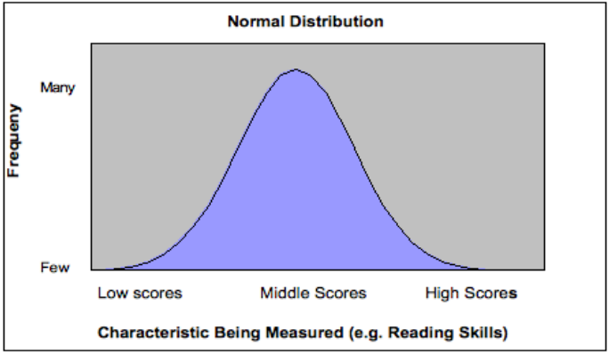

# Data Science Isn't Just for Math Nerds

- [Data Science Isn't Just for Math Nerds](#data-science-isnt-just-for-math-nerds)
  - [Introduction](#introduction)
  - [The idea behind Data Science](#the-idea-behind-data-science)
  - [The heart of Data Science(Math)](#the-heart-of-data-sciencemath)
  - [Embark on Your Data Journey](#embark-on-your-data-journey)
    - [Steps to mastering Data science](#steps-to-mastering-data-science)
      - [1. Practice programming](#1-practice-programming)
      - [2. Learn mathematics and statistics](#2-learn-mathematics-and-statistics)
      - [3. Join Data science communities](#3-join-data-science-communities)
  - [Conclusion](#conclusion)

## Introduction

People often  associate Data Science with numbers, calculations, and complexity. While math plays a significant role, Data Science goes beyond mere numerical analysis.

## The idea behind Data Science

Data Science is about using data to uncover insights that can lead to better solutions, smarter decisions, and more positive impact. Take my cousin, Alex, for example. He works at a hospital where they've been using Data Science to improve patient care and outcomes in some really cool ways.

One thing they noticed was that a lot of their heart disease patients were being readmitted to the hospital. So they dug into the data - they looked at medical records, patient feedback, even weather patterns and traffic data. Know what they found?

Turns out, a big factor was that a lot of these patients were having trouble making it to their follow-up appointments. The hospital was just too far away for some of them, especially the older patients who didn't have reliable transportation. 
[Here's a fascinating article on how Data Science is transforming healthcare facilities to improve patient access](https://hbr.org/2022/01/how-digital-transformation-can-improve-hospitals-operational-decisions)

 The Data Science team worked with the hospital to set up a network of community health centers closer to where these patients lived.
 Now, instead of having to trek all the way to the main hospital, these heart disease patients can go to a convenient local clinic for their checkups and treatments. The readmission rates have dropped dramatically, and the patients are way happier and healthier. All because the hospital used data to identify a problem and then find a smart, targeted solution.

That's the power of Data Science in action, my friend. It's not just a bunch of numbers and formulas, it's about taking all that information and turning it into something that actually makes a difference in people's lives.

Ok! you got me, I don't have a cousin named Alex(chuckle!) but as you can see this is a real life occurrence and application of Data Science.

## The heart of Data Science(Math)

But let's not forget about the math side of things. Data science isn't just for the number crunchers, but math is still a pretty important part of it.

Take the normal distribution function, for example. Sounds super fancy, right? But really, it's just a way of understanding how things tend to cluster around an average or "normal" value.

That's the normal distribution in action. Data scientists use this concept all the time to make sense of all kinds of real-world data, whether it's sales figures, test scores, or even the heights of people in a population.

Speaking of averages, let's talk about the difference between the mean and the median. The mean is the simple average, but the median is the middle value when you put all the numbers in order.

Now back to that stack of student papers. If there's one or two papers that are way off the charts, either super high or super low, the mean grade might not give you the best picture of how the class is actually performing; but, the median would show you the true middle point, which could be a more accurate representation of the overall student performance.

See, Data Science isn't just about crunching numbers, it's about using those numbers to tell a story and make better decisions. It's a tool that can be applied to all kinds of real-world situations, whether you're running a business, working in healthcare, or just trying to understand the world around you a little bit better.[For practical insights on applying mean and median in data analysis, check out this thought-provoking article: ](https://www.example.com)
   

## Embark on Your Data Journey

### Steps to mastering Data science

Now the recipe to mastering Data Science wouldn't be complete without some spices now would it(hope you are not allergic to this kind of spice ><)

#### 1. Practice programming 

* [Codewars](https://www.codewars.com/dashboard)

  I promise you'll fit right at home ,whether you are a beginner,intermediate ,advanced programmer or a casual learner.This will improve your logic and problem solving skills

* [Leetcode](https://leetcode.com/)
    
  If you are feeling ambitious,try leetcode,with interview questions to get you job ready and also equip you with algorithms from basic to advanced

#### 2. Learn mathematics and statistics

* [Projecteuler](https://projecteuler.net/)

  Previous sites also have mathematics problems and solutions for your needs,but if you want to dig right into maths try here,maths problems are categorized from easy to hard and you can use any method to solve the questions.This will make you challenge your knowledge and logic.

#### 3. Join Data science communities

* [Kaggle](https://www.kaggle.com/)

  The world's largest Data Science community with powerful tools and resources to help you achieve your Data Science goals

## Conclusion

So don't be intimidated by the math. Data science is all about taking those complex concepts and turning them into something that actually makes a difference in people's lives; and with a little bit of creativity and a whole lot of real-world application, you can slay that math dragon and become a Data Science superhero in no time!