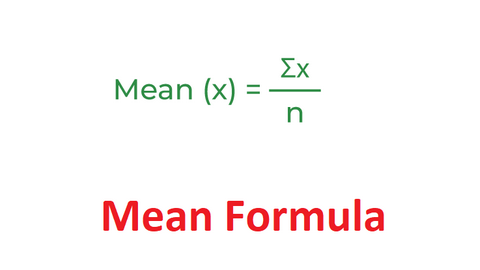

# Data Science Isn't Just for Math Nerds

- [Data Science Isn't Just for Math Nerds](#data-science-isnt-just-for-math-nerds)
  - [Introduction](#introduction)
  - [The idea behind Data Science](#the-idea-behind-data-science)
  - [The heart of Data Science(Math)](#the-heart-of-data-sciencemath)
  - [Embark on Your Data Journey](#embark-on-your-data-journey)
    - [Steps to mastering Data science](#steps-to-mastering-data-science)
      - [1. Practice programming](#1-practice-programming)
      - [2. Learn mathematics and statistics](#2-learn-mathematics-and-statistics)
      - [3. Join Data science communities](#3-join-data-science-communities)
  - [Conclusion](#conclusion)

## Introduction

People often associate Data Science with numbers, calculations, and complexity. While math plays a significant role in the field, this article emphasizes that Data Science extends far beyond mere numerical analysis.

This piece is not intended to criticize math experts; in fact, a strong mathematical foundation is incredibly valuable. Instead, it's for those who once had a passion for Data Science but felt that the emphasis on math extinguished their hopes.

Moreover, this article speaks to individuals who are uncertain about pursuing a career in Data Science, particularly those who doubt their mathematical abilities. It aims to reshape the narrative by focusing on problem-solving skills rather than the narrow view that career success is solely reserved for math experts.

## The idea behind Data Science

Data Science is about using data to uncover insights that can lead to better solutions, smarter decisions, and more positive impact.

Data Science is revolutionizing healthcare by uncovering valuable insights that lead to improved patient care and outcomes. Hospitals across the country are increasingly employing data analytics to address critical challenges, such as high readmission rates for heart disease patients.

At Johns Hopkins Medicine, they’ve been looking into why so many heart failure patients have trouble keeping up with their follow-up appointments. By digging through patient records, surveys, and even looking at things like transportation options, they found that getting to the hospital for regular check-ups was a big challenge for many, especially older patients.

To help out, they started the "Heart Failure Bridge Clinic," which is run by nurse practitioners. This clinic acts like a stepping stone for patients moving from hospital care back to their regular lives. The team there, which includes doctors, nurses, pharmacists, and social workers, works closely with each patient to make sure they’re getting the right care—things like managing their medications, following a proper diet, and learning how to handle their condition day-to-day.

This approach has made it easier for patients to get the care they need without always having to come back to the hospital, which not only improves their health outcomes but also helps reduce the chances of being readmitted. Plus, it’s a great way to ensure patients stay on track with their recovery and feel supported throughout the process.

For more details, you can check out the Johns Hopkins Medicine website [here](https://www.hopkinsmedicine.org/news/articles/2020/06/heart-failure-bridge-clinic-helps-patients-manage-disease-and-reduces-hospital-readmissions)

This example underscores the potential of data science in healthcare to not only identify barriers to care but also implement solutions that enhance patient access and quality of service. Hospitals utilizing data analytics can streamline operations and improve the overall patient experience, proving that a data-driven approach is essential for modern healthcare delivery.

In summary, data science is not just about numbers; it is about transforming insights into actionable strategies that improve patient care and operational efficiency across the healthcare spectrum.

## The heart of Data Science(Math)

But let's not forget about the math side of things. Data science isn't just for the number crunchers, but math is still a pretty important part of it.

Take the normal distribution function, for example. Sounds super fancy, right? But really, it's just a way of understanding how things tend to cluster around an average or "normal" value.

That's the normal distribution in action. Data scientists use this concept all the time to make sense of all kinds of real-world data, whether it's sales figures, test scores, or even the heights of people in a population.

Speaking of averages, let's talk about the difference between the mean and the median.

The mean is the simple average, but the median is the middle value when you put all the numbers in order.

**mean :**

-lets say you have 3 baskets of apples having, 3,5,9 apples respectively.

3+5+9=17

And because there are 3 items ,you divide by the number of baskets to get the mean
(3+5+9)/3=5.66

we'll round it off to get the valuse as a whole number.The mean becomes 6.

**median :**

-lets say you have a group of 3 people with ages 24,26,28 in a queue to sign a register 
the median of 24,26 and 28 is 26 the middle value

Now back to that stack of student papers. If there's one or two papers that are way off the charts, either super high or super low, the mean grade might not give you the best picture of how the class is actually performing; but, the median would show you the true middle point, which could be a more accurate representation of the overall student performance.

See, Data Science isn't just about crunching numbers, it's about using those numbers to tell a story and make better decisions. It's a tool that can be applied to all kinds of real-world situations, whether you're running a business, working in healthcare, or just trying to understand the world around you a little bit better.[For practical insights on applying mean and median in data analysis, check out this thought-provoking article: ](https://www.statology.org/mean-median-mode-real-life-examples/)
   

## Embark on Your Data Journey

### Steps to mastering Data science

The recipe to mastering Data Science wouldn't be complete without some spices now would it(hope you are not allergic to this kind of spice ><)

          +-------------------------------+
          |    Steps to Mastering Data    |
          |          Science               |
          +-------------------------------+
                          |
                          |
                          v
          +-------------------------------+
          |     1. Practice Programming    |
          | - Use Codewars                 |
          | - Use LeetCode                 |
          +-------------------------------+
                          |
                          |
                          v
          +-------------------------------+
          |   2. Learn Mathematics and      |
          |         Statistics              |
          | - Explore Project Euler         |
          +-------------------------------+
                          |
                          |
                          v
          +-------------------------------+
          |   3. Join Data Science         |
          |         Communities            |
          | - Engage with Kaggle           |
          +-------------------------------+
#### 1. Practice programming 

* [Codewars](https://www.codewars.com/dashboard)

  I promise you'll fit right at home ,whether you are a beginner,intermediate ,advanced programmer or a casual learner.This will improve your logic and problem solving skills

* [Leetcode](https://leetcode.com/)
    
  If you are feeling ambitious try leetcode,with interview questions to get you job ready and also equip you with algorithms from basic to advanced

#### 2. Learn mathematics and statistics

* [Projecteuler](https://projecteuler.net/)

  Previous mentioned sites also have mathematics problems and solutions for your needs,but if you want to dig right into maths try here,maths problems are categorized from easy to hard and you can use any method to solve the questions.This will make you challenge your knowledge and logic.

#### 3. Join Data science communities

  It might seem too little but a little help goes along way, any other Data Scientist knows this and every one of them is always ready to help you through any of the steps  as you master Data Science.

  Here is one such community :

* [Kaggle](https://www.kaggle.com/)

  The world's largest Data Science community with powerful tools and resources to help you achieve your Data Science goals

## Conclusion

So don't be intimidated by the math. Data science is all about taking those complex concepts and turning them into something that actually makes a difference in people's lives; and with a little bit of creativity and a whole lot of real-world application, you can slay that math dragon and become a Data Science superhero in no time!

A great first step to kickstart your journey is to join a community, such as this; [Data Science/ML/AI Discord community](https://discord.com/invite/GstMFUHd), where you'll find peers ready to support you and share their knowledge.

